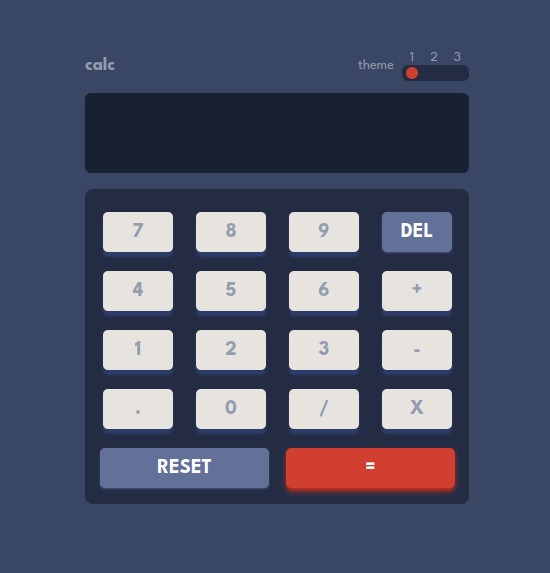

# Frontend Mentor - Calculator app solution

This is a solution to the [Calculator app challenge on Frontend Mentor](https://www.frontendmentor.io/challenges/calculator-app-9lteq5N29). Frontend Mentor challenges help you improve your coding skills by building realistic projects.

## Table of contents

- [Overview](#overview)
  - [The challenge](#the-challenge)
  - [Screenshot](#screenshot)
  - [Links](#links)
- [My process](#my-process)
  - [Built with](#built-with)
  - [What I learned](#what-i-learned)
  - [Continued development](#continued-development)
  - [Useful resources](#useful-resources)
- [Author](#author)
- [Acknowledgments](#acknowledgments)

**Note: Delete this note and update the table of contents based on what sections you keep.**

## Overview

### The challenge

Users should be able to:

- See the size of the elements adjust based on their device's screen size
- Perform mathematical operations like addition, subtraction, multiplication, and division
- Adjust the color theme based on their preference
- **Bonus**: Have their initial theme preference checked using `prefers-color-scheme` and have any additional changes saved in the browser

### Screenshot



### Links

- Solution URL: [Add solution URL here](https://github.com/ttsoares/thematicalculator)
- Live Site URL: [Add live site URL here](https://thematicalculator.vercel.app/)

## My Process

### Built with

- [React](https://reactjs.org/) - JS library
- [Next.js](https://nextjs.org/) - React framework
- [Tailwind](https://tailwindcss.com/) - CSS framework
- [Next Themes](https://www.npmjs.com/package/next-themes) - Tool to handle themes in NextJS

### What I learned

Dealing with themes in NextJS

```js
import { ThemeProvider } from "next-themes";

const Providers = ({ children }) => {
  return (
    <ThemeProvider enableSystem={false}>
      <div suppressHydrationWarning={true}>{children}</div>
    </ThemeProvider>
  );
};
```

### Continued development

Learn more about useForms and start coding in Typescript.

### Useful resources

- [Next Themes](https://www.youtube.com/watch?v=optD7ns4ISQ) - Dark Mode in Next JS 13 App Directory with TailwindCSS

## Author

- Website - [Thomas Tschoepke Soares](https://www.linkedin.com/in/thomas-soares-6791781b/)
- Frontend Mentor - [@ttsoares](https://www.frontendmentor.io/profile/ttsoares)

## Acknowledgments

Several nice people helping students with Youtube videos...
